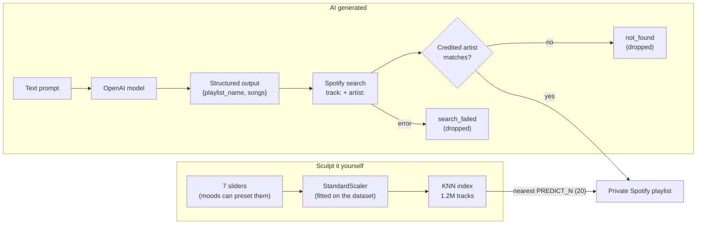

# Sound Sculptor

[](https://github.com/Dakuaisu/Sound-Sculptor/actions/workflows/ci.yml)
[](LICENSE)

Turn a mood, seven audio sliders, or a sentence into a private playlist in your Spotify account.


> There is no public live demo: Spotify apps in development mode only let allowlisted
> accounts log in (see [Limitations](#limitations)). The recording above shows both flows.

## Features

**Two ways to create playlists:**

1. **Sculpt It Yourself** — Pick your mood, fine-tune audio sliders (danceability, energy, acousticness, instrumentalness, loudness, tempo, liveness), and get the closest matches from a nearest-neighbour index of 1.2M tracks. KNN doesn't learn anything: the seven audio features of every track are standardized (zero mean, unit variance, so no feature dominates the distance) and indexed. Your slider settings become a point in that space, and the nearest tracks by Euclidean distance form the playlist.

2. **AI Generated** — Describe what you want in plain text ("chill vibes for a rainy afternoon"). The OpenAI model named in `OPENAI_MODEL` (required, no default; it must support strict `json_schema` structured outputs) returns `{playlist_name, songs: [{title, artist}]}`. Each song is searched on Spotify with `track:`/`artist:` filters and kept only if a credited artist matches. Invented songs are dropped, never swapped for something else. The Finished page says how many suggestions were found (e.g. "17 of 20 suggested songs found on Spotify") and, in a collapsible list, shows the rest with the reason: not found, or the Spotify search failed.

Both flows create a private playlist in your Spotify account.

## How it works



- **Sliders:** the browser maps each 0–100 slider onto that feature's range in the dataset
  and sends the values to `POST /api/predict`. The server standardizes them with the
  same scaler the index was built with and returns the `PREDICT_N` (default 20) nearest
  track IDs; `POST /api/create-playlist` saves them.
- **AI:** `POST /api/ai/generate` asks the model for 10–30 songs under a strict JSON
  schema, looks each one up on Spotify, keeps a hit only if one of its credited artists
  matches the suggested artist (case, accents and `feat.`/`&`/`,` credits are normalized),
  and creates the playlist from the matches. The response marks every suggestion
  `matched`, `not_found` or `search_failed` and includes the overall `match_rate`.

## Tech Stack

| Layer | Technology |
|-------|-----------|
| Frontend | React 18, React Router v6, Zustand, Vite, Tailwind CSS, Framer Motion |
| Backend | Flask, Blueprints, SpotiPy, OpenAI SDK, Flask-Session, Flask-Limiter |
| ML | scikit-learn `StandardScaler` + `NearestNeighbors`, joblib, pandas |
| Infra | Docker, Nginx, Gunicorn |

## Quick Start

### Prerequisites

- Python 3.11 (the version the pinned constraints, Docker image and CI use)
- Node.js 18+
- [Spotify Developer App](https://developer.spotify.com/dashboard) (get Client ID & Secret, and add your Spotify account under User Management)
- OpenAI API key (optional, for AI playlists)
- For slider playlists: `server/knn_index.pkl`, built from `tracks_features.csv` (see [Data](#data))

### Setup

```bash
# Clone
git clone https://github.com/Dakuaisu/Sound-Sculptor.git
cd Sound-Sculptor

# Environment variables
cp .env.example .env
# Edit .env with your Spotify and OpenAI credentials

# Backend
pip install -r server/requirements.txt   # pinned via server/constraints.txt

# Frontend
cd soundfrnt && npm install && cd ..
```

### Development

```bash
# Terminal 1 — Flask backend
python -m server.run

# Terminal 2 — Vite dev server (proxies /api to Flask)
cd soundfrnt && npm run dev
```

Open http://127.0.0.1:5173 (not `localhost`: the session cookie must be on the same host as the OAuth callback).

### Docker (Production)

```bash
# Build and run
docker compose up -d

# Or step by step
docker build -t sound-sculptor .
docker run -p 80:80 --env-file .env sound-sculptor
```

Open http://127.0.0.1

> **Note:** docker-compose mounts `./server/knn_index.pkl` into the container. Without it the AI flow still works, and `/api/predict` returns 503 with a startup warning telling you to build the index.

### Deploying beyond your machine

The image serves plain HTTP on port 80. Put it behind a TLS-terminating proxy, then:

- set `SESSION_COOKIE_SECURE=1` so the session cookie is only sent over HTTPS;
- set `FRONTEND_URL` and `SPOTIFY_REDIRECT_URI` to your `https://` origin.

### Spotify OAuth Setup

Add these redirect URIs in your [Spotify Dashboard](https://developer.spotify.com/dashboard) and set `SPOTIFY_REDIRECT_URI` to the one you use:

- Development (Vite): `http://127.0.0.1:5173/api/callback`
- Docker (local): `http://127.0.0.1/api/callback`
- Production: `https://your-domain/api/callback` (Spotify requires HTTPS for non-loopback hosts)

## Data

The slider flow runs on the Kaggle dataset
[Spotify 1.2M+ Songs](https://www.kaggle.com/datasets/rodolfofigueroa/spotify-12m-songs)
(`rodolfofigueroa/spotify-12m-songs`): one row per track with Spotify's audio features.
Kaggle lists its licence as **Unknown**, so neither `tracks_features.csv` nor the index
built from it (`server/knn_index.pkl`, 184 MB) is ever committed or redistributed here;
both are gitignored. Build the index yourself:

1. Download `tracks_features.csv` from the Kaggle page above (needs a Kaggle account).
   The copy used during development came from a public Hugging Face mirror
   (`TrishankV/Song-REcc`); its size matches Kaggle's listing and its SHA-256 is
   `39ee20762e4bbfe9aefbef7464c5500091eecfdbe0a45d33981898be2530a9e6`.
2. Put it at `server/tracks_features.csv`.
3. `python scripts/build_index.py` takes about 5 s and about 600 MB of RAM. The CSV
   has 1,204,025 rows; 2,777 with `tempo == 0` (which also have `danceability == 0`,
   i.e. failed analyses) are excluded, leaving 1,201,248 indexed tracks.

The script warns if the CSV's feature ranges differ from the slider ranges in
`soundfrnt/src/lib/featureRanges.json`.

## Limitations

- **Only allowlisted Spotify accounts can log in.** The Spotify app runs in development
  mode, which restricts login to the accounts added under User Management in the
  Spotify Developer Dashboard. That's why there's no public live demo; run it with your
  own Spotify app and account instead.
- **The slider catalogue is a static snapshot.** The dataset's newest release date is
  2020-12-18, so slider playlists never include anything released after 2020.
- **LLMs can suggest songs that don't exist,** or credit them to the wrong artist. That
  is why every AI suggestion goes through the Spotify search and artist check, and the
  ones that fail are reported instead of being quietly replaced. An AI playlist can
  therefore be shorter than what the model suggested; if nothing matches, no playlist
  is created.

## Testing

```bash
pip install -r server/requirements-dev.txt
ruff check server scripts                 # backend lint
python -m pytest server/tests -q          # backend tests
cd soundfrnt && npm run lint && npm test && npm run build
./scripts/docker-smoke.sh                 # needs Docker
```

## Recording the demo GIF

Record the screen (macOS: <kbd>Cmd</kbd>+<kbd>Shift</kbd>+<kbd>5</kbd>, "Record Selected
Portion"), then convert it with `ffmpeg`:

```bash
scripts/make_demo_gif.sh ~/Desktop/recording.mov            # writes docs/demo.gif
FPS=10 WIDTH=800 START=2 DURATION=40 scripts/make_demo_gif.sh recording.mov
```

The script builds a palette from the clip before encoding, which keeps the GIF small and sharp.

## Project Structure

```
Sound-Sculptor/
├── server/                  # Flask backend
│   ├── app.py               # Factory pattern (create_app)
│   ├── config.py            # Environment-based configuration
│   ├── run.py               # Development entry point
│   ├── requirements.txt
│   ├── blueprints/
│   │   ├── auth.py          # /api/connect, /api/callback, /api/me, /api/logout
│   │   ├── playlist.py      # /api/predict, /api/create-playlist
│   │   └── ai.py            # /api/ai/generate
│   ├── services/
│   │   ├── spotify.py       # OAuth + token management
│   │   └── ml.py            # Build/load the KNN index, nearest-neighbour queries
│   └── tests/               # pytest suite (no network; synthetic fixtures)
├── soundfrnt/               # React SPA
│   ├── src/
│   │   ├── App.jsx          # Routes
│   │   ├── components/      # brand/, layout/, ui/ (component library)
│   │   ├── pages/           # Landing, Connect, Choice, wizard steps, Finished
│   │   ├── stores/          # Zustand state management
│   │   ├── services/        # API client
│   │   ├── hooks/, lib/     # auth bootstrap, match summary, motion presets, helpers
│   │   └── styles/          # Tailwind entry CSS
│   └── vite.config.js       # Dev proxy + build config
├── scripts/build_index.py   # Builds server/knn_index.pkl from tracks_features.csv
├── scripts/docker-smoke.sh  # Builds the image and checks container behaviour
├── scripts/make_demo_gif.sh # Screen recording (.mov) → docs/demo.gif
├── .github/workflows/ci.yml # ruff + pytest, frontend lint + test + build, Docker smoke, gitleaks
├── Dockerfile               # Multi-stage: Node build → Python + Nginx
├── docker-compose.yml       # Production stack (app + model volumes)
├── nginx.conf               # SPA routing + API proxy
└── .env.example             # Required environment variables
```

## Screenshots


**Connect your Spotify account:**


**Choose how to create your playlist:**


**AI-Generated Playlist:**


**Sculpt It Yourself:**


## License

[MIT](LICENSE). The dataset isn't covered by this licence and isn't included; see [Data](#data).
